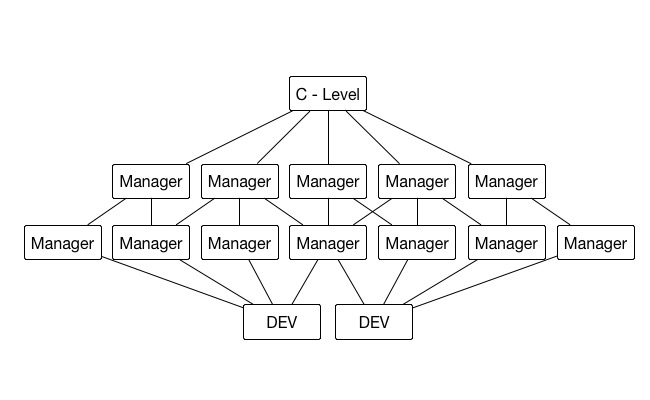
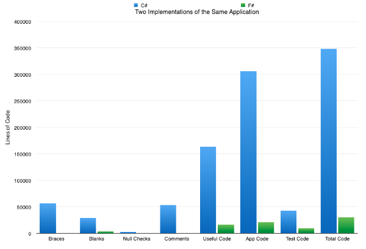
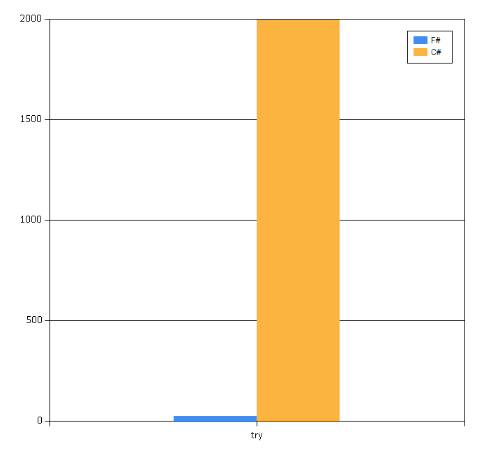
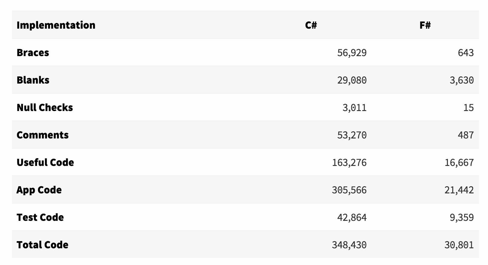
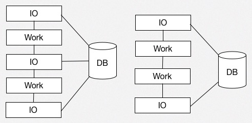

- title : Enterprise F#
- description : Introduction to F# in the Enterprise 
- author : Colin Bull
- theme : league
- transition : default

***

### About Me 

- Physics
- Software consultant
- Commodity Trading.
- Commercial F# since ~2008
- Open Source contributor
        - SqlProvider
        - HtmlProvider (FSharp.Data)
        - Fake
        - Plus a few others
- Twitter: @colinbul

***

### Enterpise - definition

*Necessary evil, not part of core business*

***

### Enterprise - Software 

' $1bn+
' Lots of talking few doing

*** 

*Opaque Initial Requirements*

***

*Agile - Sort of*

***

*Easily dismissed - always blamed.*

***

*This means your dev approach has to handle this.*

***

*The language toolset must make a difference.*

***

### So why am I talking about this?

***

### Most successful projects I have written have all been in F#

***

### A case study - Contract management system

- An opportunity to directly compare a C# and F# project over the same requirements

' You will have all seen this before but it is compelling. 

***

### Large typical enterprise system

- Complex legal contracts
- Tight computation timelines, 1 minute by minute constriants
- Lots of different data sources.

***

### Original - C# solution

- 5 years
- 8 devs
- Never fully implemented all of the contracts
- An interesting way of dealing with computation timeouts

***

### New - F# solution

- 1 year
- 3 devs at peak
- All contracts implemented
- Performace

***

### No intersection between dev teams

**We were free to potentially make the same mistakes**

***

### Some numbers

- From: http://simontylercousins.net/does-the-language-you-use-make-a-difference-revisited

' You will have probably seen this before

***

### Lines of code

' Notice null checks (actually surprisingly few)

***

### Exceptions as control flow

' This is where the nulls checks went.

***

### The raw data

' Can fit the new solution in the blanks lines of the old solution.

***

### So what was the problem in the old solution?

*** 

### Cargo cult - Object orientation

**If you have just read about a pattern use it**

***

### Global Error Flags

' These ofcourse only yield the last error. 

***

### Massive call trees to do trivial tasks

' Multiply a couple of numbers

***

### Lots of code duplication

- Contract implementations copied on a change of input data source

***

### But this is just one case 

' Well not quite.. Although the code here is probably the degenerate case 

***

### A case study 2 - Pipeline managment system

***

### Old - C# Application + VBA - Spreadsheet

- 2 devs (1 C# + 1 DB)
- ~10 Months

***

### New - F# Silverlight

- 1 dev
- ~8 Months

***

### So what was the problem?

***

### Mix of data - behaviour and data

***

### Framework magic

- WCF Data Services
- IOC
- Forced Logical Cohesion

***

### Small changes = Large impact.

*** 

### Units of Measure FTW!

- Instead of total cost (£) had (£^2 / thm)

***

### Async everywhere

- Pre C# async await
- Silverlight and F# really nice combination

***

### Am I being fair? 

- Maybe not depends on your point of view
- More experienced devs? 

***

### But isn't this the point? 

** The language didn't guide them away from this **

***

### So how does F# help?

***

### Simple core language

- #light syntax
- Easily picked up by non-professional programmers

' More features often detriments syntax.
' Scala - all things to all people (mixins, type classes..)
' C# - heading similar direction to scala

***

### Strong type system - Unions, UoM

    let fuelCost (heatRate:float<GJ>) (fuelMix:seq<float*Fuel>) =
        let computeFuelCost fuel =
            match fuel with
            | Gas(gas) -> 
                let fuelCost = 
                    ((gas.Price + gas.ExitFee) * gas.GrossToNetConversionRate)
                    |> Therm.toGigajouleRate 
                heatRate * fuelCost
            | Oil(oil) -> heatRate * oil.Price
            | Coal(coal) -> heatRate * coal.Price
         fuelMix
         |> Seq.fold (fun total (factor,fuel) -> 
                   total + (factor * (computeFuelCost fuel))
         ) 0.<``£``>

' Does everyone understand this? Explain?
' Making the compiler do the hard work.
' DU exhustive matches, new fuel = warning
' Uom - Encourages use of SI units, which can simpify things greatly. 
' Expressive - Can give this to a domain expert to verify.

***

### Active Patterns

    let (|PARTICIPANT_UMM|TSO_UMM|INVALID|) (element : XElement) = 
	    match element with
        | ROOT "participant_umm" 
            (ELEMENTS 
             (ELEMENT "affected_fuels" fuels & 
              ELEMENT "affected_units" units & 
              ELEMENT "effect_during" effect_during & 
              ELEMENT "effect_installed" & 
              ELEMENT "prodcons" & 
              ELEMENT "station" station & 
              UMM umm)) -> PARTICIPANT_UMM({ .. set record fields .. })
        | ROOT "tso_umm"  
            (ELEMENTS 
             (ELEMENT "capacity_a_b_during" ab_during & 
              ELEMENT "capacity_a_b_installed" ab_installed & 
              ELEMENT "capacity_b_a_during" ba_during & 
              ELEMENT "capacity_b_a_installed" ba_installed & 
              ELEMENT "line" line &  
              UMM umm)) -> TSO_UMM({ .. set record fields .. })
        | _ -> INVALID

' Parsing elements out of a 
' Awesome for parsing / transformations
' Of course could replace this with a TP now.

***

### Computation Expressions

    type DB = SqlProvider<..>
		
    let trades ctx = 
        query { for trade in ctx.Trades .. } 
	
    let mapToCanonicalForm trade = ...
	
    let loadCosts sourceConnection targetConnection = etl {
        let! source = resolveConnectionString sourceConnection
        let! target = resolveConnectionString targetConnection
        nonQuery (sql connection "DELETE FROM trade_data")
        query (trades DB.GetContext(source))
        transform (Seq.filter mapToCanonicalForm)
        bulkLoad target "trade_data"
    }
 
' Async, Maybe, Result etc.. 
' Allows expressive dsl's
' More than monads..
' CustomOperations

***

### There is more

- Pattern Matching 
- Immutability
- Type Providers
- Mailbox Processors
- Type Inference
- Structural Equality / Comparison
- Partial Application

' And probably more.. 
' These are all language features, but there are macro features also 
' Scott Wlaschin has a good list. 

***

### REPL, REPL, REPL

' Changes your worflow
' Iteratively develop solutions

***

### Consistent project structure

*Bottom up file ordering (Single pass compilation)*

' Consistent place to start when I open new project.
' The project explorer is telling me something more about my project
' I actually miss this on large solutions when using emacs. 
' This is probably the biggest win for the enterprise.

***

### Easy to refactor

**No tools required just a keyboard with TAB, space, Ctrl, c, v**

' Mention NTI. 
' And maybe an editor of some sort. 

***

### Other observations

**YMMV**

' but YMMV with these but somethings I have observed

***

### Uniformly structured code. 

    [<AutoOpen>]
    module DomainTypes = 
    
        type A = .....
        
    
    module A = 
    
        let validate data = ....
        
        let map data = .....

' Without a conversation our team kinda converged on this.
' Not sure whether we all read the same blogs or what.

*** 

### Seperation of IO and computation

' Important because this is a seperation of concerns
' Interlaced IO and Computation hard to reason about (Perf, Errors)
' Can structure a C# application like this but I haven't ever seen one
in a enterprise.

***

### Very little magic. 

- No Containers (Except when frameworks force it)
- No Action at a distance

' Web API
' Pure functions - IO pushed to the edges
' Type system provides a nice balance between complexity and expressivity.

***

### Simpler dependencies

*Libraries not Frameworks*

*** 

### Adopting F#

***

### Misconceptions

- F# should only be used in mathematical domains
- It is a general purpose language

***

### Baby steps

- Do not try and introduce a new language and a new paradigm

***

### Language First 

- Paradigm Second

***

### Build

- FAKE
- Common problem most devs understand
- Mostly imperative

***

### DevOps 

- One off scripts
- FAKE 
- Powershell provider
- WMI Provider

***

### An F# island

- C# application using an F# libary
- Gives an opportunity to back out to C#

***

### A Full F# web service

- Complete FSharp application

- Suave, Web API
- Topshelf
- NLog

***

### A full stack F# application

- F# as the default choice for your enterprise.
- NIRVANA!! 

***
